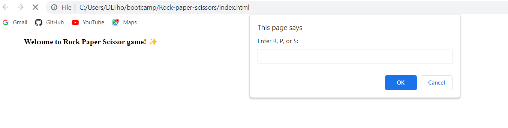

# Module 3 Mini-Project: Rock, Paper, Scissors Game

## Overview:
* Developer: Donna Thompson
* Challenge type: Creating new code for Rock, Paper, Scissors Game

<br/>

## Link to deployed application:
[donnathompson7.github.io/Rock-paper-scissors](https://donnathompson7.github.io/Rock-paper-scissors)

<br/>

## Agile requirements:
### User Story

```
* As a user, I want to play Rock, Paper, Scissors against an automated opponent.

* As a user, I can enter R, P, or S to signify my choice of rock, paper, or scissors.

* As a user, I expect the computer to choose R, P, or S in return.

* As a user, I want the option to play again whether I win or lose.

* As a user, I want to see my total wins, ties, and losses after each round.
```

### Acceptance Criteria

```
  GIVEN I want to play Rock, Paper, Scissors game
  WHEN I launch the game
  THEN I am presented with a prompt to make my choice, see what the computer chose, and who won
  WHEN I finish a round,
  THEN the score is displayed and I'm prompted to confirm if I want to play again. 
  WHEN I click OK, I play again
  WHEN I I click Cancel, the game exits
```

<br/>

## Screenshot of opening screen and dialog box for user choice:


```


